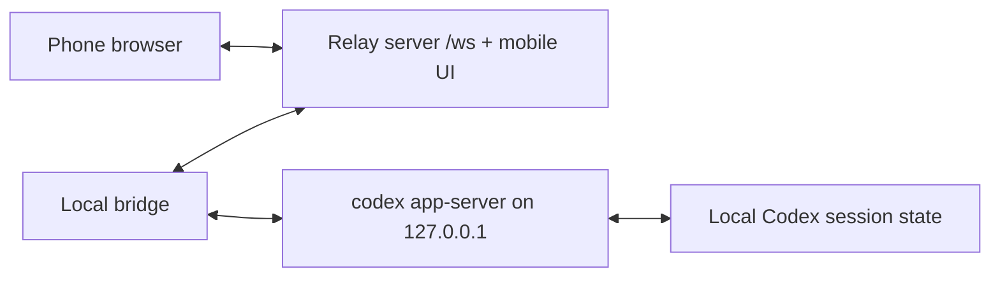

# Codex Proxy

Codex Proxy is a three-part prototype:

1. A server-side relay deployed on your VPS.
2. A local bridge that connects your desktop Codex app-server to the relay.
3. A mobile web console served by the relay, so your phone can view threads and send messages.

The relay is protocol-light. It authenticates the desktop bridge with `RELAY_TOKEN`, authenticates the phone with `PAIRING_CODE`, and forwards whitelisted Codex control requests through the bridge.

## Architecture



## Quick Start

Install dependencies:

```powershell
npm install
```

Create local environment values:

```powershell
Copy-Item .env.example .env
```

Set strong values in `.env`:

```text
RELAY_TOKEN=use-a-long-random-secret
PAIRING_CODE=use-a-phone-pairing-code
```

Start the relay server:

```powershell
$env:RELAY_TOKEN="use-a-long-random-secret"
$env:PAIRING_CODE="use-a-phone-pairing-code"
npm run dev:server
```

Start the local bridge in another terminal:

```powershell
$env:RELAY_URL="ws://localhost:8787/ws"
$env:RELAY_TOKEN="use-a-long-random-secret"
$env:CODEX_PROXY_DEVICE_NAME="Desktop Codex"
npm run dev:bridge
```

On Windows, if the bridge cannot find Codex, set `CODEX_BIN` to the real executable path:

```powershell
$env:CODEX_BIN="C:\Users\<you>\AppData\Local\OpenAI\Codex\bin\codex.exe"
npm run start:bridge
```

Open the phone console:

```text
http://localhost:8787
```

If your phone browser shows a blank page, use the lightweight fallback page:

```text
http://localhost:8787/lite
```

On a real VPS, expose the server over HTTPS and use `wss://your-domain/ws` for `RELAY_URL`.

## Capabilities

The mobile console currently supports:

- List recent Codex threads.
- Start a new thread with a prompt and optional working directory.
- Send a new turn to an existing thread.
- Interrupt the active turn when the bridge has seen its turn id.
- Forward Codex app-server events and approval requests to the phone.
- Reply to basic approval requests from the phone.

The bridge exposes a conservative Codex RPC whitelist. Raw Codex app-server RPC is blocked by default; set `ALLOW_RAW_RPC=true` only on a trusted network after reading the generated protocol under `generated/codex-app-server`.

## Security Notes

This project can control a local Codex instance, so treat it like remote administration:

- Use HTTPS/WSS in production.
- Keep `RELAY_TOKEN` long and private.
- Keep `PAIRING_CODE` private and rotate it if a phone is lost.
- Do not expose `codex app-server` directly to the internet.
- Prefer loopback app-server binding and let the bridge make the outbound relay connection.
- Leave `ALLOW_RAW_RPC=false` unless you are developing the control protocol.

## Codex Plugin Shell

The repository includes a repo-local plugin shell at `plugins/codex-proxy`. It documents how to run the bridge from Codex and can be registered later through a local marketplace if you want it visible in the Codex plugin UI.

The actual data plane is the bridge process because current Codex plugin manifests do not themselves provide a privileged API to stream every Codex internal event. The bridge uses the experimental `codex app-server` WebSocket protocol generated into `generated/codex-app-server`.

## Production Deployment Sketch

Build the server and mobile UI:

```powershell
npm run build
```

Run the server:

```powershell
$env:PORT="8787"
$env:PUBLIC_BASE_URL="https://your-domain.example"
$env:RELAY_TOKEN="use-a-long-random-secret"
$env:PAIRING_CODE="use-a-phone-pairing-code"
npm run start:server
```

Put Nginx, Caddy, or your platform proxy in front of it with WebSocket upgrade support for `/ws`.

## Docker Deployment

Docker is intended for the Linux relay server only. Keep the bridge on the computer that runs Codex.

Create a server `.env`:

```env
PORT=8787
PUBLIC_BASE_URL=https://your-domain.example
RELAY_TOKEN=replace-with-a-long-random-secret
PAIRING_CODE=replace-with-a-phone-code
```

Pull the published image and run it:

```bash
docker pull ghcr.io/2835968102/codexproxy:latest
docker compose up -d
```

Or run the image directly:

```bash
docker run -d \
  --name codexproxy \
  --restart unless-stopped \
  -p 8787:8787 \
  -e PORT=8787 \
  -e PUBLIC_BASE_URL=http://server-ip:8787 \
  -e RELAY_TOKEN=replace-with-a-long-random-secret \
  -e PAIRING_CODE=replace-with-a-phone-code \
  ghcr.io/2835968102/codexproxy:latest
```

Check status:

```bash
docker compose ps
docker compose logs -f
```

If you want to build locally instead of pulling from GHCR:

```bash
docker build -t codexproxy:local .
CODEXPROXY_IMAGE=codexproxy:local docker compose up -d
```

Phone URL:

```text
http://server-ip:8787/lite
```

If you use Caddy or Nginx for HTTPS, proxy `/` and `/ws` to `127.0.0.1:8787`, then set the Windows bridge:

```env
RELAY_URL=wss://your-domain.example/ws
RELAY_TOKEN=replace-with-the-same-long-random-secret
```

## Publishing Docker Images

Images are published to GitHub Container Registry by `.github/workflows/docker-image.yml`.

After pushing to `main`, GitHub Actions builds and publishes:

```text
ghcr.io/2835968102/codexproxy:latest
```

Tagging a release such as `v0.1.0` also publishes a matching image tag:

```bash
git tag v0.1.0
git push origin v0.1.0
docker pull ghcr.io/2835968102/codexproxy:v0.1.0
```
