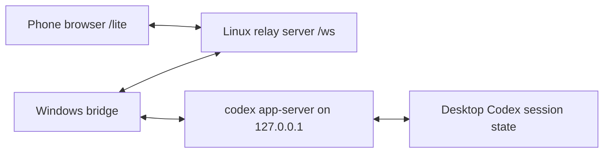

# Codex Proxy

Codex Proxy lets a phone browser control a desktop Codex session through a relay server.

It has three parts:

1. Linux relay server: runs in Docker Compose and serves `/lite` plus `/ws`.
2. Windows bridge: runs beside Codex, connects to the relay, and starts `codex app-server`.
3. Phone web UI: opens the relay URL and sends messages to the Windows Codex session.

The relay authenticates the Windows bridge with `RELAY_TOKEN`, authenticates the phone with `PAIRING_CODE`, and forwards whitelisted Codex control requests through the bridge.

## Architecture



`codex app-server` is the local Codex WebSocket API on the Windows machine. Do not expose it to the internet. Only the bridge talks to it over loopback.

## Config Files

There are two different config file formats:

| Used by | File | Format |
| --- | --- | --- |
| Linux relay | `~/codexproxy/.env` | `KEY=value` env file |
| Windows bridge | `codexproxy.local.json` | JSON |

Do not put the JSON config into `.env`. The Linux `.env` must look like `deploy/env.example`; the Windows JSON config must look like `codexproxy.local.example.json`.

## Linux Relay Deployment

Use this on the server/VPS. The relay runs in Docker Compose.

Create a directory:

```bash
mkdir -p ~/codexproxy
cd ~/codexproxy
```

Download the Compose template:

```bash
curl -fsSLo compose.yml https://raw.githubusercontent.com/2835968102/codexproxy/main/deploy/compose.yml
curl -fsSLo .env https://raw.githubusercontent.com/2835968102/codexproxy/main/deploy/env.example
```

Edit `.env`. This file is not JSON:

```env
PORT=8787
PUBLIC_BASE_URL=http://your-server-ip:8787
RELAY_TOKEN=replace-with-a-long-random-secret
PAIRING_CODE=123456
```

Start:

```bash
sudo docker compose pull
sudo docker compose up -d
```

If you previously started the relay with `docker run`, remove that old container once before switching to Compose:

```bash
sudo docker rm -f codexproxy
sudo docker compose up -d
```

Update later:

```bash
cd ~/codexproxy
sudo docker compose pull
sudo docker compose up -d
```

Check logs and status:

```bash
sudo docker compose ps
sudo docker compose logs -f
```

Phone URL:

```text
http://your-server-ip:8787/lite
```

If you use HTTPS with Caddy or Nginx, proxy `/` and `/ws` to `127.0.0.1:8787`, set `PUBLIC_BASE_URL=https://your-domain.example`, and use `wss://your-domain.example/ws` in the Windows bridge config.

## Windows Bridge Deployment

Use this on the Windows computer that runs Codex. The bridge must stay on the Codex computer because it controls the local Codex client.

Clone and install:

```powershell
git clone https://github.com/2835968102/codexproxy.git
cd codexproxy
npm install
npm run build
```

Create local config:

```powershell
Copy-Item codexproxy.local.example.json codexproxy.local.json
```

For a Linux relay at `http://150.158.38.34:8787`, edit `codexproxy.local.json`. This file is JSON:

```json
{
  "bridge": {
    "relayUrl": "ws://150.158.38.34:8787/ws",
    "relayToken": "same-value-as-linux-RELAY_TOKEN",
    "deviceName": "Desktop Codex",
    "codexBin": "C:\\Users\\<you>\\AppData\\Local\\OpenAI\\Codex\\bin\\codex.exe",
    "autoStartAppServer": true,
    "codexAppServerPort": 53179,
    "allowRawRpc": false
  }
}
```

Replace `<you>` with your Windows user name, or leave `codexBin` empty if the `codex` command is already available in PowerShell.

`bridge.relayToken` must be the same value as `RELAY_TOKEN` in the Linux server `.env`.

Start the bridge:

```powershell
npm run start:bridge
```

Expected result:

```text
bridge connected: ...
```

If Codex is installed somewhere else, update `bridge.codexBin`. If Codex is already on `PATH`, you can leave `codexBin` empty.

## Phone Connection

Open:

```text
http://your-server-ip:8787/lite
```

Enter the `PAIRING_CODE` from the Linux server `.env`.

The phone can:

- View Codex threads grouped by working directory.
- Load thread history into chat bubbles.
- Start a new thread with an optional working directory.
- Continue an existing thread without leaving its original working directory.
- Receive streamed Codex replies.

## Token Rules

`RELAY_TOKEN` is one shared secret used by both sides:

```text
Linux .env RELAY_TOKEN  ==  Windows bridge.relayToken
```

`PAIRING_CODE` is only for the phone web UI.

Keep both private. If they leak, rotate them in Linux `.env`, restart Compose, then update `codexproxy.local.json` on Windows and restart the bridge.

## Local Development

Install dependencies:

```powershell
npm install
```

Create local config:

```powershell
Copy-Item codexproxy.local.example.json codexproxy.local.json
```

For all-local development, set both `server` and `bridge` in `codexproxy.local.json`. This is JSON, not `.env`:

```json
{
  "server": {
    "port": 8787,
    "publicBaseUrl": "http://localhost:8787",
    "relayToken": "use-a-long-random-secret",
    "pairingCode": "123456"
  },
  "bridge": {
    "relayUrl": "ws://localhost:8787/ws",
    "relayToken": "use-a-long-random-secret",
    "deviceName": "Desktop Codex"
  }
}
```

Start the relay:

```powershell
npm run dev:server
```

Start the bridge in another terminal:

```powershell
npm run dev:bridge
```

Config priority is: real environment variables, then `codexproxy.local.json`, then `.env`, then defaults. `codexproxy.local.json` is ignored by git because it can contain private tokens.

## Security Notes

This project can control a local Codex instance, so treat it like remote administration:

- Use HTTPS/WSS in production when possible.
- Keep `RELAY_TOKEN` long and private.
- Keep `PAIRING_CODE` private and rotate it if a phone is lost.
- Do not expose `codex app-server` directly to the internet.
- Prefer loopback app-server binding and let the bridge make the outbound relay connection.
- Leave `ALLOW_RAW_RPC=false` unless you are developing the control protocol.

## Publishing Docker Images

Images are published to GitHub Container Registry by `.github/workflows/docker-image.yml`.

After pushing to `main`, GitHub Actions builds and publishes:

```text
ghcr.io/2835968102/codexproxy:latest
```

Tagging a release such as `v0.1.0` also publishes a matching image tag:

```bash
git tag v0.1.0
git push origin v0.1.0
docker pull ghcr.io/2835968102/codexproxy:v0.1.0
```
