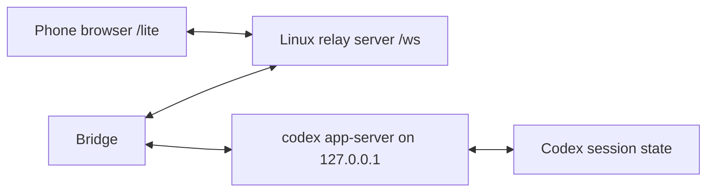

# Codex Proxy

Codex Proxy lets a phone browser control a Codex session through a relay server.

It has three parts:

1. Linux relay server: runs in Docker Compose and serves `/lite` plus `/ws`.
2. Bridge: connects the relay to an existing `codex app-server`. It can run directly on Windows, or as a lightweight Linux Docker container.
3. Phone web UI: opens the relay URL and sends messages through the bridge to Codex.

The relay authenticates bridges with `RELAY_TOKEN`, authenticates the phone with `PAIRING_CODE`, and forwards whitelisted Codex control requests through the selected bridge session.

The Linux bridge image does not include Codex CLI. It only runs the bridge process and connects to a `codex app-server` that is already running on the Linux host.

## Architecture



`codex app-server` is the local Codex WebSocket API. Do not expose it to the internet. Only the bridge should talk to it, preferably over loopback.

## Config Files

There are two config file formats:

| Used by | File | Format |
| --- | --- | --- |
| Linux relay | `~/codexproxy/.env` | `KEY=value` env file |
| Windows bridge | `codexproxy.local.json` | JSON |
| Linux bridge container | `~/codexproxy-bridge/.env` | `KEY=value` env file |

Do not put the JSON config into `.env`. The relay `.env` must look like `deploy/env.example`; the Linux bridge `.env` must look like `deploy/bridge.env.example`; the Windows JSON config must look like `codexproxy.local.example.json`.

## Linux Relay Deployment

Use this on the server/VPS. The relay runs in Docker Compose.

Create a directory:

```bash
mkdir -p ~/codexproxy
cd ~/codexproxy
```

Download the Compose template:

```bash
curl -fsSLo compose.yml https://raw.githubusercontent.com/2835968102/codexproxy/main/deploy/compose.yml
curl -fsSLo .env https://raw.githubusercontent.com/2835968102/codexproxy/main/deploy/env.example
```

Edit `.env`. This file is not JSON:

```env
PORT=8787
PUBLIC_BASE_URL=http://your-server-ip:8787
RELAY_TOKEN=replace-with-a-long-random-secret
PAIRING_CODE=123456
```

Start:

```bash
sudo docker compose pull
sudo docker compose up -d
```

If you previously started the relay with `docker run`, remove that old container once before switching to Compose:

```bash
sudo docker rm -f codexproxy
sudo docker compose up -d
```

Update later:

```bash
cd ~/codexproxy
sudo docker compose pull
sudo docker compose up -d
```

Check logs and status:

```bash
sudo docker compose ps
sudo docker compose logs -f
```

Phone URL:

```text
http://your-server-ip:8787/lite
```

If you use HTTPS with Caddy or Nginx, proxy `/` and `/ws` to `127.0.0.1:8787`, set `PUBLIC_BASE_URL=https://your-domain.example`, and use `wss://your-domain.example/ws` in the bridge config.

## Windows Bridge Deployment

Use this on the Windows computer that runs Codex. This mode can auto-start `codex app-server` because the bridge process runs directly on the same Windows host as Codex.

Clone and install:

```powershell
git clone https://github.com/2835968102/codexproxy.git
cd codexproxy
npm install
npm run build
```

Create local config:

```powershell
Copy-Item codexproxy.local.example.json codexproxy.local.json
```

For a Linux relay at `http://150.158.38.34:8787`, edit `codexproxy.local.json`. This file is JSON:

```json
{
  "bridge": {
    "relayUrl": "ws://150.158.38.34:8787/ws",
    "relayToken": "same-value-as-linux-RELAY_TOKEN",
    "sessionId": "desktop-codex",
    "deviceName": "Desktop Codex",
    "codexBin": "C:\\Users\\<you>\\AppData\\Local\\OpenAI\\Codex\\bin\\codex.exe",
    "autoStartAppServer": true,
    "codexAppServerPort": 53179,
    "allowRawRpc": false
  }
}
```

Replace `<you>` with your Windows user name, or leave `codexBin` empty if the `codex` command is already available in PowerShell.

`bridge.relayToken` must be the same value as `RELAY_TOKEN` in the Linux relay `.env`.

`bridge.sessionId` is optional but recommended. It gives this bridge a stable ID, so the phone can reconnect to the same bridge after refresh or relay restart. Use a different `sessionId` for every bridge, for example `desktop-codex` and `linux-codex`.

Start the bridge:

```powershell
npm run start:bridge
```

Expected result:

```text
bridge connected: ...
```

If Codex is installed somewhere else, update `bridge.codexBin`. If Codex is already on `PATH`, you can leave `codexBin` empty.

## Linux Bridge Container Deployment

Use this only when the Codex environment you want to control is on the Linux host. The bridge container does not include Codex CLI and does not run Codex itself.

First, make sure Codex works on the Linux host:

```bash
codex --version
```

Start `codex app-server` on the Linux host and keep it running:

```bash
codex app-server --listen ws://127.0.0.1:53179
```

For a server deployment, you can keep it alive with systemd. Replace `ubuntu` and the `codex` path if your user or install path is different:

```bash
command -v codex
sudo tee /etc/systemd/system/codex-app-server.service >/dev/null <<'EOF'
[Unit]
Description=Codex app-server
After=network.target

[Service]
User=ubuntu
WorkingDirectory=/home/ubuntu
Environment=PATH=/usr/local/bin:/usr/bin:/bin
ExecStart=/usr/bin/env codex app-server --listen ws://127.0.0.1:53179
Restart=always
RestartSec=3

[Install]
WantedBy=multi-user.target
EOF
sudo systemctl daemon-reload
sudo systemctl enable --now codex-app-server
sudo systemctl status codex-app-server
```

Then create a bridge Compose directory:

```bash
mkdir -p ~/codexproxy-bridge
cd ~/codexproxy-bridge
curl -fsSLo compose.yml https://raw.githubusercontent.com/2835968102/codexproxy/main/deploy/bridge.compose.yml
curl -fsSLo .env https://raw.githubusercontent.com/2835968102/codexproxy/main/deploy/bridge.env.example
```

Edit `.env`. This file is not JSON:

```env
RELAY_URL=ws://your-relay-server:8787/ws
RELAY_TOKEN=same-value-as-linux-relay-RELAY_TOKEN
CODEX_PROXY_SESSION_ID=linux-codex
CODEX_PROXY_DEVICE_NAME=Linux Codex Bridge
CODEX_APP_SERVER_URL=ws://127.0.0.1:53179
CODEX_AUTO_START_APP_SERVER=false
ALLOW_RAW_RPC=false
```

If the relay runs on the same Linux host, `RELAY_URL=ws://127.0.0.1:8787/ws` is OK because `deploy/bridge.compose.yml` uses host networking. If the relay is on another server, use that server's IP or domain.

Start the bridge container:

```bash
sudo docker compose pull
sudo docker compose up -d
```

Update later:

```bash
cd ~/codexproxy-bridge
sudo docker compose pull
sudo docker compose up -d
```

Check logs:

```bash
sudo docker compose logs -f
```

When you create a new thread from the phone, the working directory must be a path that the Linux host Codex can see, for example `/home/ubuntu/projects/my-repo`. You do not need to mount that project into the bridge container, because Codex is running outside the bridge container.

If Codex itself is running inside another container, the working directory must be valid inside that Codex container. That is a separate deployment shape from this bridge-only image.

## Phone Connection

Open:

```text
http://your-server-ip:8787/lite
```

Enter the `PAIRING_CODE` from the Linux relay `.env`.

The phone can:

- View bridge sessions.
- View Codex threads grouped by working directory.
- Load thread history into chat bubbles.
- Start a new thread with an optional working directory.
- Continue an existing thread without leaving its original working directory.
- Receive streamed Codex replies.

## Session ID

`sessionId` identifies one bridge session on the relay. It is not a password and does not replace `RELAY_TOKEN`.

If a bridge does not set a session ID, the relay generates a random one when that bridge connects. That works, but the phone may need to select the new random session again after the bridge reconnects.

Use a stable session ID when you want a fixed phone target:

```json
{
  "bridge": {
    "sessionId": "desktop-codex"
  }
}
```

For Linux bridge container `.env`:

```env
CODEX_PROXY_SESSION_ID=linux-codex
```

## Token Rules

`RELAY_TOKEN` is one shared secret used by the relay and every bridge:

```text
Linux relay .env RELAY_TOKEN  ==  Windows bridge.relayToken
Linux relay .env RELAY_TOKEN  ==  Linux bridge .env RELAY_TOKEN
```

`PAIRING_CODE` is only for the phone web UI.

Keep both private. If they leak, rotate them in the Linux relay `.env`, restart relay Compose, then update every bridge config and restart each bridge.

## Local Development

Install dependencies:

```powershell
npm install
```

Create local config:

```powershell
Copy-Item codexproxy.local.example.json codexproxy.local.json
```

For all-local development, set both `server` and `bridge` in `codexproxy.local.json`. This is JSON, not `.env`:

```json
{
  "server": {
    "port": 8787,
    "publicBaseUrl": "http://localhost:8787",
    "relayToken": "use-a-long-random-secret",
    "pairingCode": "123456"
  },
  "bridge": {
    "relayUrl": "ws://localhost:8787/ws",
    "relayToken": "use-a-long-random-secret",
    "deviceName": "Desktop Codex"
  }
}
```

Start the relay:

```powershell
npm run dev:server
```

Start the bridge in another terminal:

```powershell
npm run dev:bridge
```

Config priority is: real environment variables, then `codexproxy.local.json`, then `.env`, then defaults. `codexproxy.local.json` is ignored by git because it can contain private tokens.

## Security Notes

This project can control a Codex instance, so treat it like remote administration:

- Use HTTPS/WSS in production when possible.
- Keep `RELAY_TOKEN` long and private.
- Keep `PAIRING_CODE` private and rotate it if a phone is lost.
- Do not expose `codex app-server` directly to the internet.
- Prefer loopback app-server binding and let the bridge make the outbound relay connection.
- Leave `ALLOW_RAW_RPC=false` unless you are developing the control protocol.

## Publishing Docker Images

Images are published to GitHub Container Registry by `.github/workflows/docker-image.yml`.

After pushing to `main`, GitHub Actions builds and publishes:

```text
ghcr.io/2835968102/codexproxy:latest
ghcr.io/2835968102/codexproxy-bridge:latest
```

Tagging a release such as `v0.1.0` also publishes matching image tags:

```bash
git tag v0.1.0
git push origin v0.1.0
docker pull ghcr.io/2835968102/codexproxy:v0.1.0
docker pull ghcr.io/2835968102/codexproxy-bridge:v0.1.0
```

To build locally:

```bash
docker build --target relay -t codexproxy:relay .
docker build --target bridge -t codexproxy:bridge .
```

The publish build is complete when the GitHub Actions `Docker image` workflow is green and the GHCR package shows the expected tag.
